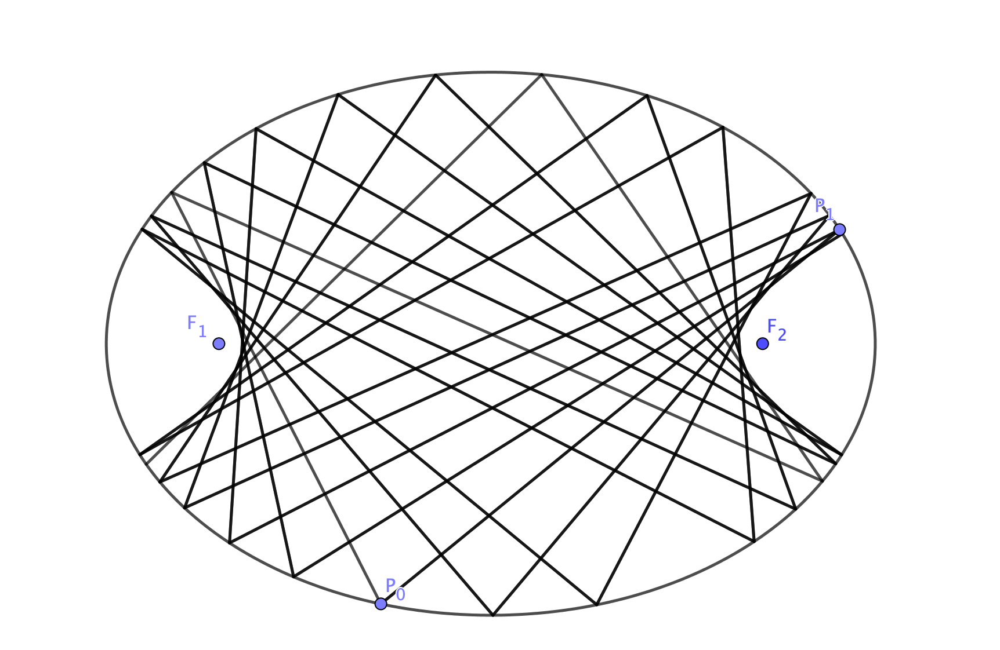

# Dynamical Billiards
Visualises what would happen if you were to play billiards on an elliptical table without energy loss. You can find more details about this on [GeoGebra](https://www.geogebra.org/m/euzqtn5p) or on my blog.

